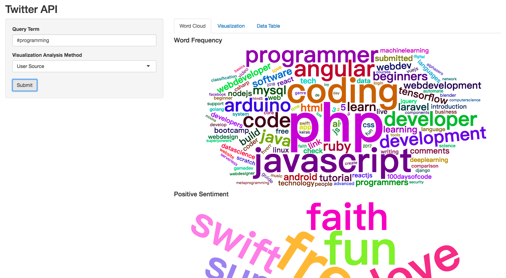
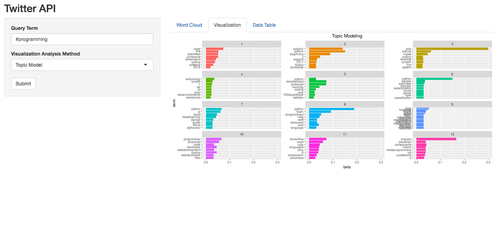
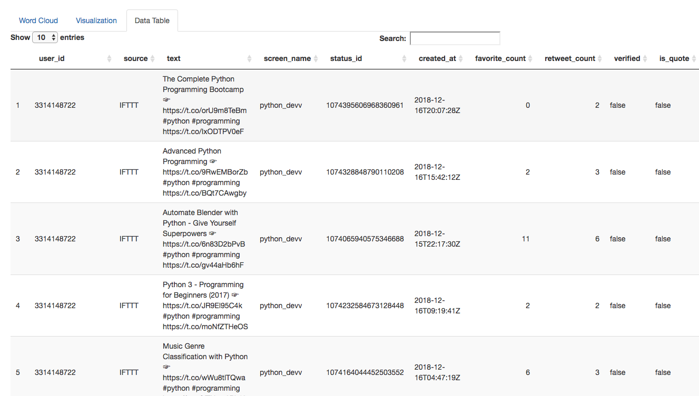

```{r, include=FALSE}
knitr::opts_chunk$set(message = FALSE, warning = FALSE)

if (!("DT" %in% installed.packages()[, 1])){
  install.packages("DT")
}
if (!("devtools" %in% installed.packages()[, 1])){
  install.packages("devtools")
}
if (!("ggmap" %in% installed.packages()[, 1])){
  devtools::install_github("dkahle/ggmap")
}
if (!("wordcloud2" %in% installed.packages()[, 1])){
  devtools::install_github("lchiffon/wordcloud2")
}

```

## Project Overview

Immigration has been a topic under heated public discussion in American politics.  In particular, research shows that the public holds extremely divided opinion on the topic. We propose to develop a Shiny app that collects and visualizes real-time public sentiment of the Immigration issue on Twitter. To start with, we will create a Twitter APP to gain keys to the API. We use “Search Tweet” APIs to collect information. We analyze the text of the Tweets using Word Cloud, Sentiment Analysis, and Topic Modeling. We also geo-tag the a sample of the retrieved Tweets to understand where the topic of immigration is prevalent. Finally, we create a Shiny App that allows users to input a query term of interest to search for recent Tweets.

## Scraping Twitter Data

The first step of our project is scraping tweets from Twitter. We set up a developer account for an app called `immigration_trend` to access Twitter's API. We implement our scrpaer using the `rtweet` package. This is to our knowledge the most stable package that wrap API requests to Twitter (as of the time we develop this project). Specifically, our API requests have the following features:

- **Number of tweets**: We search among 180,000 tweets for our topic of interest. This is the maximum of Twitter's rate limit in search.
- **Query term**: We search for the harshtag `#immigration`. We select the particular harsh, instead of words, to limit the scope of the collected tweets to those explicitly talking about the topic, excluding those mentioning the term in the passing.
- **Range of Time**: We request the most recent tweets by the time of the query. The data we analyze is based on a query made on December 14. The retrieved tweets are posted from December 4 to December 14.
- **Limit of Location**: We did **NOT** limit the geo-location of the tweets. We initially wanted to narrow down to tweets posted in the United States by limit the geo-location a radius of 3381 miles around the geographic center of the United States (39.50, -98.35). But it ends up only returning less than 1000 tweets. We assume it is because few tweets are geo-tagged. So we lift the limit of geo-location.

Note: To save runtime and to interpret our results, the code of this part is by default not evaluated (we set `eval=FALSE`). We save tweets we retrieved on December 14 (which include a set of 9653 tweets posted from December 4 to December 14, 2018). The rest of the analyses are based on this retrieved dataset.

```{r, eval = FALSE}
#----------------
# Set Twitter key
#----------------

api_key = "Hgj9nhsN2FPhruxxpwhttnBOS"
api_secret = "IQXwprbhJYzBCqhEIpkJLcuPSPQaYTMWadj3BMg3nWrcnBIpwd"
access_token = "1068608387334766593-BpB8hUTe09InPeeGrAqZF9Rk2SEomb"
access_secret = "phFEUzi8xfvjaS7XKi5i8VNjXzoDUh326mcJ6SczheBH6"

#----------------
# Load package
#----------------
if (!("rtweet" %in% installed.packages()[,])){
  install.packages("rtweet")
}
library(rtweet)
library(tidyverse)

#----------------
# Scrapte Tweets
#----------------

create_token(
  app = "immigration_trend",
  consumer_key = api_key,
  consumer_secret = api_secret,
  access_token = access_token,
  access_secret = access_secret)

rt = search_tweets(
  "#immigration", n = 18000, include_rts = FALSE, 
  # geocode = "39.50,-98.35,3881mi", # Limit it to the United States. doesn't work
  verbose = TRUE,
  parse = TRUE,
  retryonratelimit = FALSE
)

saveRDS(rt, "data/raw.rds")
```

## Cleaning Scraped Twitter Data

In this section, we explain how the data is cleaned. The `rtweet` package takes initial steps parsing the data for us. Our further checking and cleaning include the following steps.

- Diagnostic plot: We make a diagnostic plot to show the trend of patterns (how many tweets with the immigration hashtag per 24 hours).
- Select a subset of variables: We only take a subset of columns of interest. The **text** of the tweet is our focus. In addition, we select of group of measures of the tweets characteristics, such as their sources, the response they receive, and so on.
- Language: We are only interested in Tweets posted in English. So we filter out tweets whose language are not labeled as `en`.

With the above steps of data cleaning, we have a dataset of 7704 tweets, each with 24 variables. Below we show the code and output of the above described steps

### Setup

```{r}
#-------------------------------
# Load package and stored data
#-------------------------------
library(rtweet)
library(tidyverse)
library(lubridate)
library(stringr)

rt = readRDS("data/raw.rds")
```

### Diagnostic Plot

```{r}
#------------------
# Diagnostic plot
#------------------
ts_plot(rt, "24 hours") +
  theme_minimal() +
  theme(plot.title = ggplot2::element_text(face = "bold")) +
  labs(
    x = NULL, y = NULL,
    title = "Frequency of #rstats Twitter statuses from past 9 days",
    subtitle = "Twitter status (tweet) counts aggregated using three-hour intervals",
    caption = "\nSource: Data collected from Twitter's REST API via rtweet"
)
```

### Subset Variables and Language

```{r}
### select relevant variables
data <- rt %>%
  select(user_id, status_id, created_at, screen_name, text, source, display_text_width, 
         is_quote, is_retweet, favorite_count, retweet_count, 
         hashtags, media_type, lang, name, location, 
         followers_count, friends_count, listed_count, statuses_count,
         favourites_count, account_created_at, verified, account_lang) %>%
  filter(account_lang %in% c("en"))

saveRDS(data, "data/data.rds")
```

## Text Data Analysis

We perform some basic Natural Language Processing algorithm to understand what the tweets are about.With this analysis, we find that the tweets include an extensive discussion of the politics of immigration. Also, the tweets cover discussions about immigration in not only the United States, but also Canada, Australia and Europe. We use the specific tools below:

- Word Cloud
- Sentiment Analysis
- Topic Modeling

### Setup and Data Cleaning

We primarily use the package `tidytext`, `wordcloud2`, and `topicmodels`. We initially remove stopwords from the text data using the dataset attached to the above packages. Then, we **extend** the dictionary of stopwords by examining the data. We added tokens such as "https", "t.co", and "amp" as they are part of URLs frequently appearing in Tweets. 

```{r}  
#---------------
# Load packages
#---------------
library(tidytext)
library(topicmodels)
devtools::install_github("lchiffon/wordcloud2")
library(wordcloud2)

#---------------
# Stop words
#---------------

# Load stop words dataset
data("stop_words")

# Customized stop words
stop_word_add = tibble(
    word = c("https", "t.co", "amp"), 
    lexicon = NA)

# Merge into the stop word data
stop_words_ext = 
  stop_words %>% bind_rows(stop_word_add)
```

### Word Cloud of Frequent Words

We make word cloud of frequent words. As the word cloud shows, the top frequent words include "immigrants", "trump", "border", and "visa". This is in line with our expection about what words are closely related to the issue. Trump is a frequently mentioned words because the stake of politics in politics is high. 

```{r}
#-----------------------------
# Word cloud (frequent words)
#-----------------------------
word_count = data %>% 
  select(text) %>%
  unnest_tokens(word, text) %>% 
  anti_join(stop_words_ext) %>% # Remove stop words
  count(word, sort = TRUE) 

word_count %>%
  filter(n > 100) %>%
  wordcloud2(size = 4)
```

### Sentiment Analysis

We perform sentiment analysis on the tweets. We are particularly interested in what are the most frequent positive and negative sentiment words associated with the topic of immigration. We use a dictionary of the `tidytext` package.

- Positive sentiment: Frequent words of positive sentiment include "free", "love", "top", and "liberty." We find these words associated with policy attitudes of the pro-immigration Twitter users. 
- Negative sentiment: Frequent words of negative sentiment include "illegal", "undocumented", "racism", "harms." Only part of these words are not evidently associated with expressed opinions. Many of them are more likely neutral description of the type of issue concerned ("illegal", "undocumented"). Some other types appear to be accusion of the pro-immigration Twitter users against the anti-immigration groups ("racism"). Some are the other way round ("hypocrasy").

We plot the wordcloud of the above two groups of words.

```{r}
#-----------------------------
# Word cloud (sentiment)
#-----------------------------

# Positive Sentiment
word_count %>%  
  inner_join(get_sentiments("bing")) %>%
  filter(sentiment == "positive") %>%
  filter(word != "trump") %>% # misclassified as positive
  filter(n > 10) %>%
  wordcloud2(color = "random-light")

# Negative Sentiment
word_count %>%  
  inner_join(get_sentiments("bing")) %>%
  filter(sentiment == "negative") %>%
  filter(word != "trump") %>%
  filter(n > 10) %>%
  wordcloud2(color = "random-light")

```


### Topic Modeling

We perform topic modeling to cluster Tweets into various categories. Below we first summarize some details of the implementation and then discuss some findings. 

Implementation

- Data cleaning: Stop words are removed before we create a document-term-mentrix. Also, we reduce the sparsity of the document-term-matrix to 99.8%, leading to a final DTM of 7554 rows (a few tweets containing only sparse terms are removed) and 1127 unique tokens.
- We also remove the term "immigration". This is because, given the query, this word appear in all documents, which makes it uninformative.
- We set the number of topic $k = 12$. The value of $k$ is a result of some trials and errors.
- We use the `LDA` function from the `topicmodels` package.
- We plot the top words associated with each topic by retrieving the fitted $\beta$'s from the model.

Findings: There are a diverse set of dissussion on different elements of immigration.

- Topic 2 is clearly a topic about Donald Trump, the current US president. Top words assocaiated it include Trump's Tweeter account name "realdonaldtrump" and some of his campaign slogans "buildthewall" and "maga".
- Topic 5 is likely a topic about US visa. Topic words associated with it include "visa", "uscis", and "h1b."
- Topic 12 is clearly about immigration issues **outside** the United States. Top words include "brexit", "uk", and "eu."

Limitation: We attempt to summarize what's in the set of tweets by interpreting the top words of each identified topic. But this may still miss the variation of contents in the tweets.

Below is our code for topic modeling.

```{r, eval=FALSE}
#------------
# Create DTM
#------------
dtm = data %>% 
  select(status_id, text) %>%
  unnest_tokens(word, text) %>% 
  anti_join(stop_words_ext) %>%
  group_by(status_id, word) %>%
  summarise(n = n()) %>%
  filter(word != "immigration") %>% # remove the word that every tweet has
  cast_dtm(status_id, word, n)

#--------------------
# Remove sparse term
#--------------------
dtm_t = tm::removeSparseTerms(dtm, 0.998)

rowTotals = apply(dtm_t, 1, sum)
dtm_t = dtm_t[rowTotals> 0,]

dtm_t$nrow
dtm_t$ncol

#---------------
# Fit LDA model
#---------------
library(topicmodels)
m_lda <- LDA(dtm_t, k = 12, control = list(seed = 201812))
saveRDS(m_lda, "data/m_lda.rds")
```

```{r, fig.width=8, fig.height=6}
#------------------
# Visualize topics
#------------------
m_lda = readRDS("data/m_lda.rds")

m_lda %>%
  tidy() %>%
  group_by(topic) %>%
  top_n(8, beta) %>%
  ungroup() %>%
  mutate(term = reorder(term, beta)) %>%
  ggplot(aes(term, beta, fill = factor(topic))) +
  geom_col(show.legend = FALSE) +
  facet_wrap(~ topic, ncol = 3, scales = "free_y") +
  coord_flip() + ggtitle("Topic Modeling")
```

## Analysis of Other Features
In this section，we furtuer analysis some other features of tweets.\ 

1. mention number plot: In this plot, we would like to visualze the the change of number of tweets which mentions "immigration" over a ceratain time period. Based on the tweets we captured, we did find a trend.\

2. favorite tweets: Then we find out the tweets with the most favorite counts. Based on the data we captured, the tweets which got the most favor is  "After all of the toxic fuming about border security, it turns out that Trump regularly hires undocumented immigrants to work at his golf clubs! The constant hypocrisy of this president is mind-boggling. https://t.co/VCzdpT56jh #Trump #BorderWall #Immigration #hypocrisy #Mexico https://t.co/pMX3dypOyn"\

3. source: We then visualize the source of tweets, and we find half of the tweets are sent from Twitter for Iphone and Twitter Web Client. 

4. screen_name: We also find out the top five screen_name that send most mumber of tweets related to "immigration", and find that the most top five are "ANDmagazine", "immigrationvisa","immigrateNews", "smartdissent" and "Une Violee". 

5. verified: The pie chart shows the result of whether the user who send tweets related to "immigration" are verified their account, and the results show that only 4% of users are verified. 

6. quote: This pie chart shows the result shows the result of whether the tweets is quote, and we find only 15% tweets include quote, so most of the tweets related "immigration" are original. 

```{r}

#mention number
rt.time = data %>%
  select(created_at) %>%
  mutate(date = date(created_at)) %>%
  group_by(date) %>%
  summarise(mention_num = n())

ggplot(rt.time, aes(x = date, y = mention_num)) +
  geom_line() +
  geom_point() +
  ggtitle("Mention Number") +
  theme(plot.title = element_text(hjust = 0.5))


# favorite_count: show the tweet which get the most favorite
index.fav = which.max(data$favorite_count)
favorite.text  = data$text[index.fav]

# user_information--source(order in plot?)
source.data = data %>%
  select(user_id, source) 

index = duplicated(source.data)
source.data = source.data[!index,] %>%
  group_by(source) %>%
  summarise(count = n()) %>%
  arrange(desc(count)) %>%
  mutate(percent = count/sum(count)*100) %>%
  as.data.frame() %>%
  .[1:5,]

ggplot(source.data) +
  geom_bar(mapping = aes(x=source, y=percent,fill=source), stat = "identity") +
  ggtitle("Source") +
  theme(plot.title = element_text(hjust = 0.5))
  

#screen name
source.data.1 = data %>%
  select(user_id, screen_name) 

source.data.1 = source.data.1%>%
  group_by(screen_name) %>%
  summarise(count = n()) %>%
  arrange(desc(count)) %>% 
   .[1:5,]

ggplot(source.data.1) +
  geom_bar(mapping = aes(x=screen_name, y=count,fill=screen_name), stat = "identity") +
  ggtitle("screen_name") +
  theme(plot.title = element_text(hjust = 0.5))+
  theme(axis.text.x = element_text(angle = 45, hjust = 1))


#is quote
source.data.2=data %>%
  select(user_id,is_quote) 
source.data.2 =source.data.2%>% 
  group_by(is_quote) %>% 
  summarise(count=n()) %>% 
  mutate(percent = count/sum(count)*100)


ggplot(source.data.2, aes("", percent, fill = is_quote)) +
    geom_bar(width = 1, size = 1, color = "white", stat = "identity") +
    coord_polar("y") +
    geom_text(aes(label = paste0(round(percent), "%")), 
              position = position_stack(vjust = 0.5)) +
    labs(x = NULL, y = NULL, fill = NULL, 
         title = "is quote? ") +
    guides(fill = guide_legend(reverse = TRUE)) +
    theme_classic() +
    theme(axis.line = element_blank(),
          axis.text = element_blank(),
          axis.ticks = element_blank(),
          plot.title = element_text(hjust = 0.5, color = "#666666"))


#verified

source.data.3=data %>%
  select(user_id,verified) 
source.data.3 =source.data.3%>% 
  group_by(verified) %>% 
  summarise(count=n()) %>% 
  mutate(percent = count/sum(count)*100)


ggplot(source.data.3, aes("", percent, fill = verified)) +
    geom_bar(width = 1, size = 1, color = "white", stat = "identity") +
    coord_polar("y") +
    geom_text(aes(label = paste0(round(percent), "%")), 
              position = position_stack(vjust = 0.5)) +
    labs(x = NULL, y = NULL, fill = NULL, 
         title = "is_verified") +
    guides(fill = guide_legend(reverse = TRUE)) +
    theme_classic() +
    theme(axis.line = element_blank(),
          axis.text = element_blank(),
          axis.ticks = element_blank(),
          plot.title = element_text(hjust = 0.5, color = "#666666"))


```


## Geo-Tagging Tweets

We perform geo-tagging on the Tweets by their authors' self-reported location. This data is extremely noisy. They are reported in text. Users may enter names of country, city, or state. They can also enter terms that are not locations as we understand it (e.g. "God knows", "Worldwide", URL link).

We use `ggmap` which provides a wrapper of Data Science Toolkit API to geo-tag our location data. Below are some details of our implementation.

- We hard-code some frequent locations that we would like to remove: United States, America, and USA. The above locations will be geo-tagged to the geographic center of the United States, which makes it hard to view the reported distribution of tweets at the local level in the US.
- We select a *random sample* of 2500 Tweets that have valid location entry as to geo-tag. This is due to the daily rate limit of Google Map. We initially wanted to tag all. But for replicability of the code, we end up with this sample. We argue that wht randomly sample can represent the distribution of our whole dataset.

Findings:

- Worldwide: Most of the Tweets about immigration are located in the United States. But a significantly large proportion are in Europe, especially the UK (this makes sense because I subset English Tweets). Also some others are located in Africa, Asia, South America and Australia.

- In the United States: We see a even distribution of Tweets. Area where the topic are frequently mentioned include New York, California, and Florida.

### Geo-Tagging with `ggmap`

```{r, eval = FALSE}
#---------------------
# Clean location data
#---------------------
loc_sum = data %>%
  group_by(location) %>%
  summarise(n = n()) %>%
  arrange(wt = -n)

# Hard-code away names that do not make sense
loc_to_na = tolower(c("", "United States", "America", "USA", "Global"))
data$location_t = data$location
data$location_t[which(data$location_t %in% loc_to_na)] = NA

#--------------------------
# Random sample 2500
#--------------------------
data_geo = data %>%
  select(status_id, location_t) %>%
  filter(!is.na(location_t)) %>%
  sample_n(2500)

#--------------------------
# Geo-code with ggmap
#--------------------------
# Install the ggmap package if not available
library(ggmap)

# Geo-code tweets
lon_lat = geocode(data_geo$location_t, source = "dsk")

# Save data
data_geo = data_geo %>% mutate(lon = lon_lat$lon, lat = lon_lat$lat)
saveRDS(data_geo, "data/data_geo.rds")  
``` 

### Visualization

```{r}
# Load map data
world = map_data("world")
states = map_data("state")

# Load Geo-tagged Tweet data
data_geo = readRDS("data/data_geo.rds")
```

```{r, fig.align="center"}
# World map
ggplot(data = world) + 
  geom_polygon(aes(x = long, y = lat, group = group) , fill= "white", color = "black") + 
  coord_fixed(1.3) +
  geom_point(data = data_geo, aes(x = lon, y = lat), alpha = .5, color = "blue") +
  theme(axis.title.x=element_blank(), axis.title.y=element_blank())
```

```{r, fig.align="center"}
# US State map
ggplot(data = states) + 
  geom_polygon(aes(x = long, y = lat, group = group), color = "black", fill = "white") + 
  coord_fixed(1.3) +
  geom_point(data = data_geo, aes(x = lon, y = lat), alpha = .5, color = "blue") +
  xlim(c(min(states$long), max(states$long))) + 
  ylim(c(min(states$lat), max(states$lat))) +
  theme(axis.title.x=element_blank(), axis.title.y=element_blank())
```


## Shiny App

We create a Shiny application that allows users to view recent Tweets of a query term of interest. When an user input a query word and click the "submit" button, our App search for 2000 recent Tweets containing the term with the Twitter API (limited to English Tweets). Then, it draws a word cloud to show frequent of the found Tweets. We also use `Data Table` to show the original returned data in a seperate panel. Our App also shows visualization of the user information, their sentiment, and the topics included (through topic modeling). 

Note that we put code of our Shiny App in a separate file named `shiny-app.Rmd`. Below we show some screenshots of the app.








